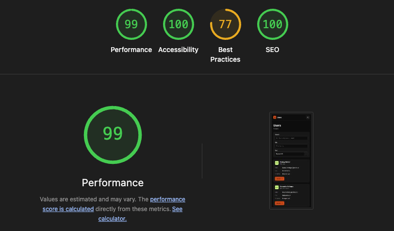

# Users

## Level

Middle Frontend Developer

## How to run

Requirements: Node.js 22 or another version supported by Vite 8, and npm.

```bash
npm install
npm run dev
```

Quality checks:

```bash
npm run lint
npm run typecheck
npm test
npm run build
```

*The text below was written by me and polished with AI assistance for clear, grammatically correct sentences.*

## Decisions

**Stack**
Used: React 19, strict TypeScript, React Router, Vite, Tailwind CSS v4.
Reason: modern, fast defaults; no extra state or data-fetching library needed at this scope.

**Project structure**
Used: most code lives under a domain-first `src/users` folder, with its own `components`, `pages`, `hooks`, `helpers`, `api`, `storage`, and `types` subfolders.
Reason: this mirrors how a larger production app would be organized, so adding more features later would keep the project structured instead of forcing a rewrite.

**Styling**
Used: Tailwind CSS v4, no component library.
Reason: fast utility styling without adopting a full design system for one screen.

**Data fetching**
Used: fetch the full user collection once (`GET /users`, no query params); search, filter, sort, and pagination run client-side over that cached list.
Reason: the fixture never exceeds ten records, so server-pagination machinery would have nothing to prove.

**Search**
Used: case-insensitive substring match against name and email.
Reason: partial typing should return results immediately, like real search UX.

**City filter**
Used: free-text, case-insensitive substring match.
Reason: a complete city selector needs the full dataset up front anyway; free text is simpler at this scale.

**Sort**
Used: locale-aware ascending/descending toggle by name.
Reason: name is the only sort field in the brief, so one toggle covers it.

**Pagination**
Used: client-side, page size 10, controls hidden until results exceed 10.
Reason: matches the real fixture size while still proving pagination logic (tested with an 11-record case).

**Detail view**
Used: separate lazy route that reads the user from the already-fetched collection.
Reason: avoids a duplicate network request and keeps one source of truth.

**Edit persistence**
Used: name overrides saved to a versioned `localStorage` schema (`user-name-overrides:v1`).
Reason: satisfies "survives a reload" without a backend.

**Edited vs. fresh data**
Used: the local name always wins over the API name; every other field always comes from the latest API response.
Reason: an intentional edit shouldn't be silently overwritten, but stale unrelated fields shouldn't linger.

**Race protection**
Used: `AbortController` plus a request-sequence id around the one fetch and its Retry action.
Reason: prevents a slow or duplicate response from overwriting a newer one.

**Loading/error/empty states**
Used: distinct UI for loading, request error with Retry, empty data, no matching filters, and unknown user IDs; no artificial delays or failures in production code.
Reason: the brief requires the UI to visibly hold up under slow or failing conditions.


**Responsive & device testing**
Used: light/dark themes, keyboard and pointer input, checked at 390/768/873/1024/1440px, plus mobile Lighthouse audits in isolated Chrome.
Reason: the brief requires proof beyond desktop and a mouse.



**Tests**
Used: 48 tests covering race protection, merge precedence, filtering/sorting/pagination, and storage failure, plus lint, typecheck, and a production build with separate list/detail chunks.
Reason:TESTES WRITTEN BY AI. the brief values meaningful coverage over a token test.

**TypeScript**
Used: strict mode with `noUncheckedIndexedAccess`.
Reason: required by the brief; catches unsafe array/object access.

Other: editing happens only on the detail page; name validation only rejects empty values, no extra length or character rules.

## Gaps and contradictions in the brief

- The brief asks the UI to "hold up when slow, when a request fails, and with far more rows than ten," but the fixture is fast, reliable, and fixed at ten — those conditions can only be shown via DevTools throttling or tests, never a real run.
- "A component or styling library is fine" sits next to "a design system is out of scope," with no line drawn between them — Tailwind (used here) is itself a codified set of design decisions.

## What is still wrong with this

- Fetching everything once only works because the fixture is fixed at ten records — a real dataset would need server-driven search/filter/sort/pagination again, plus a real city filter-options endpoint.
- Browser checks and focused tests aren't a full physical-device or screen-reader certification matrix.

## What I would need before building this for real

- How many users are we actually talking about, and can the real API filter, sort, and paginate on its own, or would we have to build that ourselves?
- Do we need to track errors and usage in production, and is there a privacy policy that limits what we're allowed to log?
